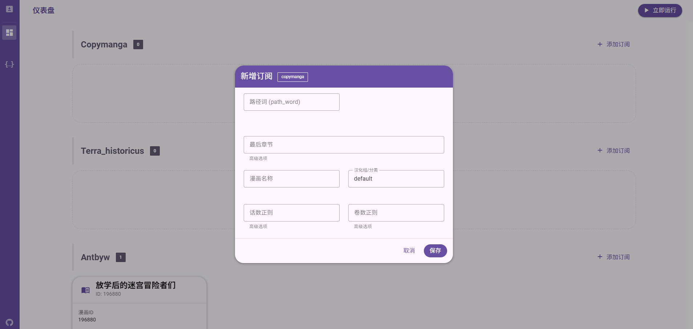
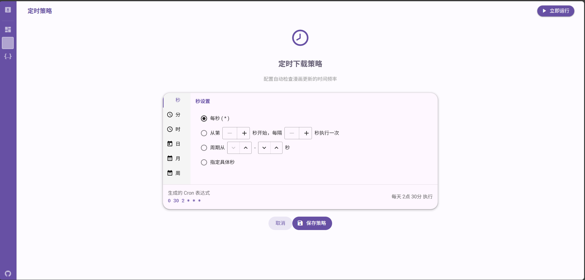
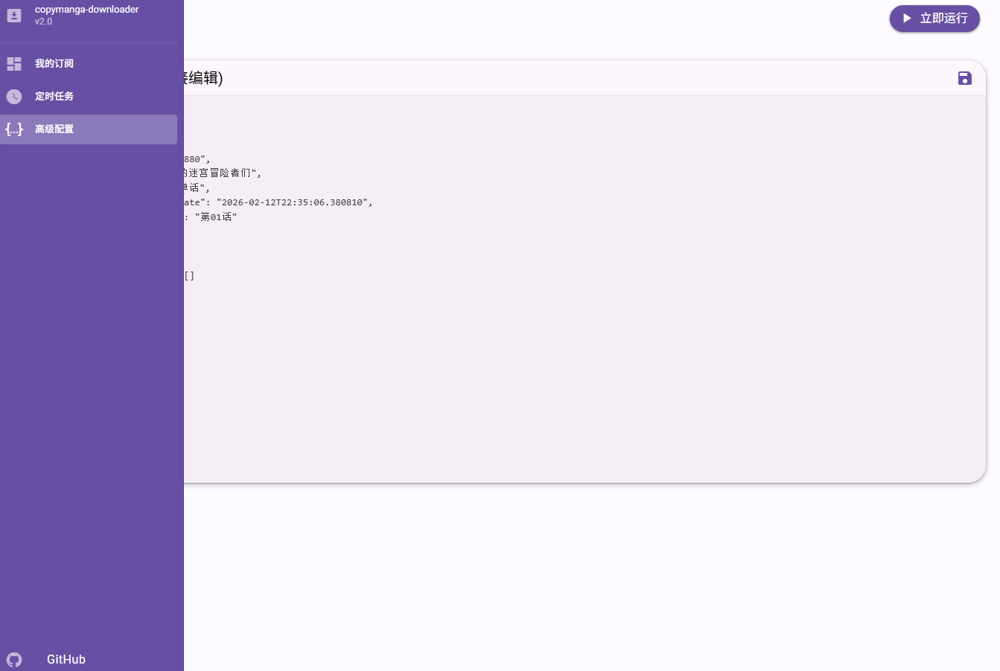

# copymanga-nasdownloader


<p align="center">
  <!--<a href="https://pypi.org/project/copymanga-downloader/" target="_blank"></a>-->
  <a href="https://github.com/misaka10843/copymanga-nasdownloader/graphs/contributors" target="_blank"></a>
  <a href="https://github.com/misaka10843/copymanga-nasdownloader/stargazers" target="_blank"></a>
</p>

## 前言💭

此仓库是[copymanga-downloader](https://github.com/misaka10843/copymanga-downloader)的重构版本，专门为Nas系统进行设计

请注意，因为是为Nas设计的所以可能会优化很多功能

如果是桌面使用建议使用copymanga-downloader而不是nasdownlaoder

建议使用青龙面板等来自定义触发时间与管理

**非常非常非常不建议您每次运行时间间隔小于5天！！！！**

您需要注意的一点，为了尽可能不影响到相关站点，此程序并不会也永不会支持多线程处理，请多多支持对应站点，小站真的不容易

## 当前支持站点

- [x] [copymanga](https://copymanga.com)
- [x] [泰拉记事社](https://terra-historicus.hypergryph.com)
- [x] [antbyw](https://www.antbyw.com)

## 如何使用

本仓库是为了nas系统下载而进行优化，所以下载器本身并没有任何的交互/配置界面

下载器的配置是通过环境变量进行设置，更新列表是通过json进行设置

在运行下载器之前请确保bash的目录在程序目录下

### 配置下载器

请将本仓库中的`.env.sample`更名为`.env`放在cmd的运行目录下

其中各个变量的内容如下

```dotenv
CMNAS_TOKEN= # token填写，必须登录，否则会无法请求其章节详细
CMNAS_DOWNLOAD_PATH= # 下载路径(暂存路径，将在cbz打包完成后删除)(字符串)
CMNAS_CBZ_PATH= # CBZ存放路径(字符串)
CMNAS_DATA_PATH= # 配置文件相关存放路径(字符串)
CMNAS_USE_CM_CNAME= # 是否使用copymanga的章节名，如果不使用将按照kavita的格式进行命名(True/False)
CMNAS_API_URL= # API服务器地址(字符串)
CMNAS_LOG_LEVEL= # 日志等级(DEBUG,INFO,WARNING,ERROR)
CMNAS_CM_USERNAME= # copymanga 账户名称
CMNAS_CM_PASSWORD= # copymanga 密码
CMNAS_CM_PROXY= # copymanga 使用的代理
```

### 使用webUI/docker

如果您需要使用WebUI或者docker，请确保创建了`.env`文件

如果您想直接从代码库中运行WebUI，请确保运行了`frontend`中的前端文件以及运行`python3 server.py`

#### docker compose部署

```yml
version: '3.8'

services:
  cmnas:
    image: ghcr.io/misaka10843/copymanga-nasdownloader:latest
    # 如果是国内网络请注释上方的代码，然后将下方代码的#删除掉
    #image: ghcr.nju.edu.cn/misaka10843/copymanga-nasdownloader:latest
    container_name: cmnas
    restart: unless-stopped
    ports:
      - "8000:8000"  # Web 访问端口
    volumes:
      # 映射数据目录 (配置文件、日志)
      - ./data:/data
      # 映射下载目录 (临时下载文件)
      - ./downloads:/downloads
      # 映射 CBZ 输出目录 (最终打包文件)
      - ./cbz:/cbz
    environment:
      # --- 基础配置 ---
      - CMNAS_LOG_LEVEL=INFO

      # --- Copymanga 账号配置 ---
      # 如果你的 config.py 优先读取环境变量，填在这里
      - CMNAS_CM_USERNAME=your_username
      - CMNAS_CM_PASSWORD=your_password

      # --- 代理配置 ---
      # 注意：如果使用本机代理，在Docker中可能需要写 http://host.docker.internal:7890
      - CMNAS_CM_PROXY=

      # --- API URL ---
      - CMNAS_API_URL=https://api.mangacopy.com

      # --- 行为配置 ---
      # 是否使用copymanga原名 (True/False)
      - CMNAS_USE_CM_CNAME=False
```

将上方的内容保存到`docker-compose.yml`中，然后运行`docker compose up -d`即可部署完成

---

在部署完成之后您可以打开url然后访问WebUI

在WebUI中允许直接配置所有当前插件的配置文件以及支持定时运行更新任务，以及直接编辑`updater.json`




### 配置更新列表

当前只能自行进行配置(之后会做一个web界面进行配置管理)

请在`CMNAS_DATA_PATH`的目录下创建`updater.json`

#### copymanga

其中内部的结构如下：

```json
{
  "copymanga": [
    {
      "name": "漫画名称(指定保存的系列名/文件夹名)",
      "ep_pattern": "重命名的话数的正则提取，默认可以为空",
      "vol_pattern": "重命名的卷数的正则提取，默认可以为空",
      "path_word": "copymanga的path_word",
      "group_word": "copymanga的group_word，默认为default",
      "latest_chapter": "最后下载的章节，可以用来限制下载范围(为空则直接下载所有的内容)",
      "last_download_date": "最后下载章节的完成日期"
    },
    {
      "name": "漫画名称(指定保存的系列名/文件夹名)",
      "ep_pattern": "重命名的话数的正则提取，默认可以为空",
      "vol_pattern": "重命名的卷数的正则提取，默认可以为空",
      "path_word": "copymanga的path_word",
      "group_word": "copymanga的group_word，默认为default",
      "latest_chapter": "最后下载的章节，可以用来限制下载范围(为空则直接下载所有的内容)",
      "last_download_date": "最后下载章节的完成日期"
    }
  ]
}
```

示例如下

````json
{
  "copymanga": [
    {
      "name": "白圣女与黑牧师",
      "ep_pattern": "连载版(\\d+\\.?\\d*)",
      "vol_pattern": "",
      "path_word": "baishengnvyuheimushi",
      "group_word": "default",
      "latest_chapter": "连载版02",
      "last_download_date": "2025-04-05T20:58:29.386183"
    },
    {
      "name": "静音酱今天也睡不着觉",
      "ep_pattern": "",
      "vol_pattern": "",
      "path_word": "jinyingjiangjintianyeshuibuzhaojiao",
      "group_word": "default",
      "latest_chapter": "",
      "last_download_date": ""
    }
  ]
}
````

#### 泰拉记事社

对于漫画ID获取可以直接前往官网点击任何一个漫画例如 `https://terra-historicus.hypergryph.com/comic/6253` 中的 `6253`
就是漫画ID

配置结构如下

```json
{
  "terra_historicus": [
    {
      "name": "漫画名称",
      "comic_id": 漫画id(数字),
      "latest_chapter": "最后下载的章节，可以用来限制下载范围(为空则直接下载所有的内容)",
      "last_download_date": "最后下载章节的完成日期"
    }
  ]
}
```

示例如下

```json
{
  "terra_historicus": [
    {
      "name": "暮岁闲谈：这是平凡人生",
      "comic_id": 4579,
      "last_download_date": "2025-07-30T15:17:12.854869",
      "latest_chapter": "这是平凡人生"
    }
  ]
}
```

#### antbyw

对于漫画ID获取可以直接前往官网点击任何一个漫画例如
`https://www.antbyw.com/plugin.php?id=jameson_manhua&a=read&kuid=196880` 中的 `196880`（kuid的值）
就是漫画ID

配置结构如下

```json
{
  "antbyw": [
    {
      "comic_id": "漫画ID",
      "name": "漫画名称",
      "group_word": "单话/单行本/番外篇",
      "last_download_date": "",
      "latest_chapter": ""
    }
  ]
}
```

示例如下

```json
{
  "antbyw": [
    {
      "comic_id": "196880",
      "name": "放学后的迷宫冒险者们",
      "group_word": "单话",
      "last_download_date": "",
      "latest_chapter": ""
    }
  ]
}
```

如果需要下载两个及以上的站点可以通过下方结构配置

```json
{
  "copymanga": [
    {
      "name": "白圣女与黑牧师",
      "ep_pattern": "连载版(\\d+\\.?\\d*)",
      "vol_pattern": "",
      "path_word": "baishengnvyuheimushi",
      "group_word": "default",
      "latest_chapter": "连载版02",
      "last_download_date": "2025-04-05T20:58:29.386183"
    }
  ],
  "terra_historicus": [
    {
      "name": "暮岁闲谈：这是平凡人生",
      "comic_id": 4579,
      "last_download_date": "2025-07-30T15:17:12.854869",
      "latest_chapter": "这是平凡人生"
    }
  ]
}
```

在配置完成之后直接运行程序即可

## 如何开发其他站点

`copymanga-nasdownloader` 采用模块化设计，增加新站点支持需要遵循以下步骤。

(如果不会可以看当前已有的站点)

### 核心流程

1. **定义 Updater**: 在 `updater/` 目录下创建站点更新器，负责获取章节列表和对比本地记录。
2. **定义 Plugin**: 在 `plugins/` 目录下创建站点插件，负责解析具体章节的图片 URL 并下载。
3. **注册站点**: 在 `updater/updater.py` 和 `dispatcher.py` 中注册新站点的映射关系。

### 开发步骤

#### 第一步：创建更新器 (Updater)

在 `updater/your_site.py` 中继承 `BaseUpdater`：

* `get_chapters()`: 调用 API 或爬取网页，返回包含章节名称和 ID 的列表。
* `find_subsequent_uuids()`: 根据 `updater.json` 中的 `latest_chapter` 过滤出需要下载的新章节 ID。
* `create_download_task()`: 构造传递给插件的任务字典。

#### 第二步：创建下载插件 (Plugin)

在 `plugins/your_site/main.py` 中实现：

* `download_batch(tasks)`: 插件的入口点。
* `download_chapter()`: 处理单章逻辑。
* 调用 `downloader.downloader` 下载图片。
* 下载完成后调用 `downloader.postprocess` 进行 CBZ 打包。

#### 第三步：配置与注册

1. **环境变量**: 如需特殊配置（如 Cookie/Token），在 `utils/config.py` 和 `.env.sample` 中添加。
2. **映射注册**:

* `updater/updater.py` -> `SITE_MAPPING`
* `dispatcher.py` -> `SITE_MODULES`
