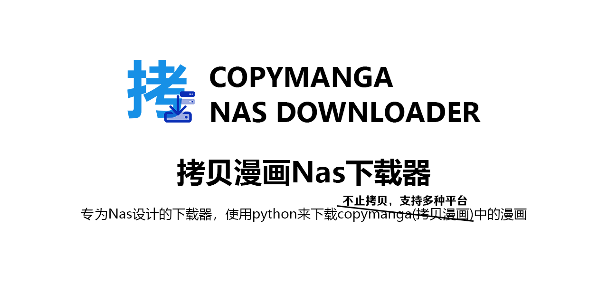

# copymanga-nasdownloader

  <!---->
  
  

## 前言💭

此仓库是[copymanga-downloader](https://github.com/misaka10843/copymanga-downloader)的重构版本，专门为Nas系统进行设计

请注意，因为是为Nas设计的所以可能会优化很多功能

如果是桌面使用建议使用copymanga-downloader而不是nasdownlaoder

建议使用青龙面板等来自定义触发时间与管理